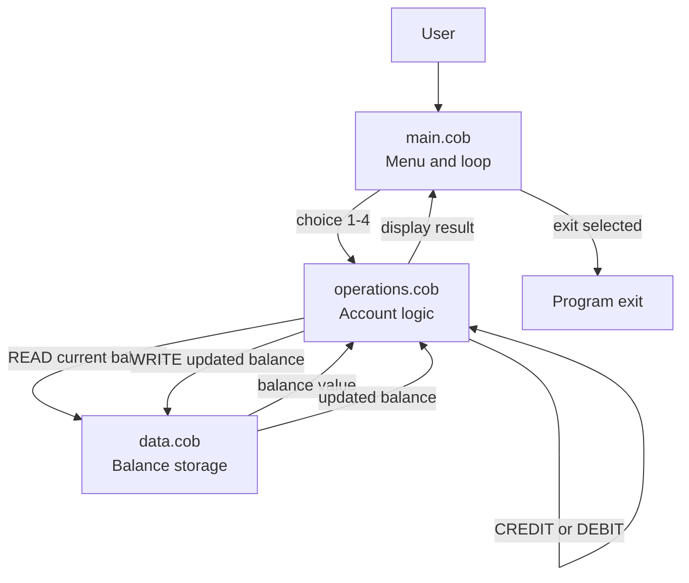

# Legacy Accounting System Overview

This document summarizes the purpose, behavior, and key business rules of the COBOL-based school accounting system.

## File responsibilities

- [src/cobol/main.cob](../src/cobol/main.cob) — user interface and main program loop
- [src/cobol/operations.cob](../src/cobol/operations.cob) — account operations and business logic
- [src/cobol/data.cob](../src/cobol/data.cob) — persistent balance storage and read/write behavior

## Main program flow

The [src/cobol/main.cob](../src/cobol/main.cob) program presents a simple menu-driven console screen. It repeatedly prompts the user to choose from the following actions:

1. View balance
2. Credit account
3. Debit account
4. Exit

Based on the selected option, it calls the operations program with a fixed operation code such as `TOTAL `, `CREDIT`, or `DEBIT `.

## Operations logic

The [src/cobol/operations.cob](../src/cobol/operations.cob) module contains the real business logic for the account system.

### Supported operations

- `TOTAL `: reads the current balance from storage and displays it.
- `CREDIT`: prompts for an amount, reads the current balance, adds the credit, writes the updated balance back, and displays the new total.
- `DEBIT `: prompts for an amount, reads the current balance, verifies sufficient funds, subtracts the value, writes the result back, and reports the outcome.

### Key business rules

- The account starts with an initial balance of `1000.00`.
- Transactions are performed through calls to the data module.
- A debit is only allowed if the current balance is greater than or equal to the debit amount.
- If the user enters an invalid menu option, the program shows an error message and continues.
- The program exits only when the user chooses the `Exit` option.

## Data storage behavior

The [src/cobol/data.cob](../src/cobol/data.cob) file is responsible for managing the stored balance value.

- `READ` retrieves the current balance from storage.
- `WRITE` stores the passed balance back into the in-memory balance variable.
- The balance is stored as a numeric field with two decimal places, preserving monetary precision.

## Data flow diagram

## Summary

This accounting system is a simple console application that demonstrates the core workflow of a legacy business system: collect input, apply rules, read and write balance data, and report the result back to the user.
